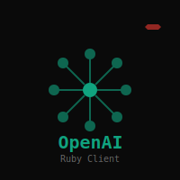

# OpenAI Terminal 2.1 - Modern TUI for OpenAI

 [](https://badge.fury.io/rb/openai-term)  

 A powerful, modern terminal interface for OpenAI's API featuring a full Text User Interface (TUI) built with rcurses. Version 2.1 adds chat scrolling, enhanced UX, and improved conversation management - all from your terminal.
<br clear="left"/>

## 🎉 Version 2.1 - Enhanced Experience!

**New features**: Chat window scrolling, improved UI consistency, and better conversation management. Built on the solid foundation of the 2.0 complete rewrite.

## ✨ Features

### Core Functionality
- **🎮 Interactive Chat Interface**: Full TUI with separate panes for chat history and input
- **🤖 Model Selection**: Browse and select from available OpenAI models in real-time
- **🖼️ Image Generation**: Generate images with DALL-E using dedicated commands
- **💾 Conversation Management**: Save, load, and manage conversation history
- **📋 Clipboard Integration**: Copy AI responses to system clipboard
- **🎨 Color-coded Interface**: Beautiful, easy-to-read colored output

### User Experience
- **⌨️ Vim-like Controls**: Command mode with printable characters entering input mode
- **📜 Input History**: Navigate through previous messages with arrow keys
- **📃 Chat Scrolling**: Scroll through long conversations with PgUp/PgDown
- **🎨 Smart Prompts**: Dynamic prompt styling that dims when inactive
- **🔄 Model Persistence**: Remembers your preferred model between sessions
- **📁 Session Management**: Auto-save conversations and settings
- **❓ Built-in Help**: Comprehensive help system with keyboard shortcuts
- **📊 Version Checking**: Check for updates from RubyGems

### Advanced Features
- **🚀 Quiet Mode**: Skip TUI for direct command-line usage in scripts
- **⚙️ Configurable Parameters**: Set max tokens, temperature, and other options
- **🎯 Multiple Input Methods**: Type directly, load from files, or use command-line args
- **🔒 Secure Configuration**: API key stored in separate config file

## 📦 Installation

```bash
gem install openai-term
```

## 🚀 Quick Start

### Interactive Mode (Recommended)
```bash
openai
```

### Command Line Usage
```bash
# Quick question
openai -t "What is quantum computing?"

# Load from file
openai -f my_question.txt

# Generate image
openai -i -t "A beautiful sunset over mountains"

# Use specific model
openai -m gpt-4 -t "Write a poem about code"

# Quiet mode (no TUI)
openai -q -t "Quick answer needed"
```

## ⌨️ Keyboard Controls

| Key | Action |
|-----|--------|
| **Ctrl-Q** | Quit application |
| **Ctrl-M** | Select AI model |
| **Ctrl-H** | Show help |
| **Ctrl-C** | Clear chat history |
| **Ctrl-L** | Load saved conversation |
| **Ctrl-S** | Save conversation |
| **Ctrl-Y** | Copy last AI response to clipboard |
| **Ctrl-V** | Show version information |
| **Ctrl-I** | Generate image |
| **↑/↓** | Navigate input history |
| **PgUp/PgDn** | Scroll chat window up/down |
| **Any char** | Start typing message |
| **ESC** | Cancel input (in edit mode) |

## ⚙️ Configuration

### API Key Setup
On first run, edit `~/.openai.conf`:
```ruby
@ai = 'your-openai-api-key-here'
```

Get your API key from: https://platform.openai.com/api-keys

### Command Line Options
```bash
Usage: openai [options]
  -f, --file FILE          Load initial query from file
  -t, --text TEXT          Initial query text
  -m, --model MODEL        AI model (default: gpt-3.5-turbo)
  -x, --max-tokens N       Max tokens (default: 2048)
  -T, --temperature N      Temperature 0-2 (default: 0.7)
  -i, --image             Generate image instead of text
  -c, --config FILE       Config file path
  -q, --quiet             Skip TUI and output to stdout
  -h, --help              Display help
  -v, --version           Display version
```

## 📁 Files

- **Config**: `~/.openai.conf` - API key configuration
- **History**: `~/.openai_history.json` - Conversation history and settings

## 🔧 Requirements

- Ruby 2.7+
- rcurses gem (~> 3.5)
- ruby-openai gem (~> 3.0)

## 🆕 What's New in 2.1

### New Features
- **📃 Chat Window Scrolling**: Use PgUp/PgDown to scroll through long conversations
- **🎨 Enhanced UI Consistency**: Input prompts now match chat window styling
- **⏫ Latest Conversations First**: Conversation list now shows newest conversations at the top
- **🖱️ Smart Prompt Behavior**: Input prompt dims when not in edit mode for better visual feedback

### Previous Major Changes (2.0)
- **Complete rewrite** using rcurses for modern TUI
- **Interactive chat interface** with proper panes and layouts
- **Real-time model selection** with live preview
- **Conversation management** - save, load, and organize chats
- **Enhanced input handling** with vim-like behavior
- **Clipboard integration** for easy sharing
- **Persistent settings** - remembers your preferences

## 📚 Examples

### Interactive Session
```bash
# Start the app
openai

# Type your message and press Enter
# Use Ctrl-M to change models
# Use Ctrl-S to save conversations
# Use Ctrl-L to load previous chats
```

### Scripting and Automation
```bash
# Get quick answers
openai -q -t "What's 2+2?"

# Process files
openai -q -f input.txt > output.txt

# Generate images for automation
openai -i -q -t "Logo design" > image_url.txt
```

## 🔄 Migration from 1.x

Version 2.0 maintains compatibility with 1.x command-line usage while adding the powerful TUI interface. Your existing scripts will continue to work, but you can now enjoy the interactive experience when running without the `-q` flag.

## 🤝 Contributing

This project is public domain. Feel free to use, modify, and distribute as needed.

## 🔗 Links

- **Gem**: https://rubygems.org/gems/openai-term
- **Source**: https://github.com/isene/openai
- **rcurses**: https://github.com/isene/rcurses
- **Author**: https://isene.com

---

*Built with ❤️ using [rcurses](https://github.com/isene/rcurses) for an amazing terminal experience.*